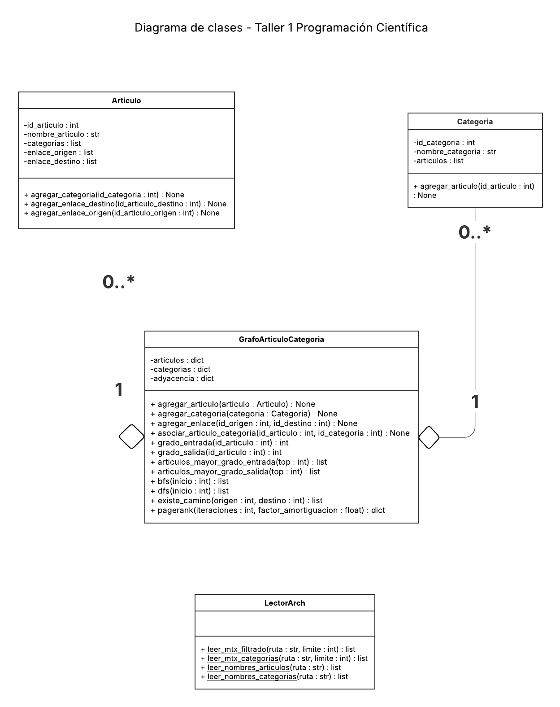

<div align="center">

# Taller 1 Programación Científica

### Análisis estructural de una red de artículos de Wikipedia mediante grafos dirigidos, métricas topológicas y PageRank simplificado

<br>

<table>
  <tr>
    <td><b>Integrantes</b></td>
    <td>Francisco Cortés · Fabián Díaz · Ignacia Peña</td>
  </tr>
  <tr>
    <td><b>Asignatura</b></td>
    <td>Minor Programación Científica</td>
  </tr>
  <tr>
    <td><b>Profesor</b></td>
    <td>Cristhian Alberto Rabi Reyes</td>
  </tr>
  <tr>
    <td><b>Ayudante</b></td>
    <td>Roberto Javier Fernández Berrios</td>
  </tr>
  <tr>
    <td><b>Establecimiento</b></td>
    <td>Universidad Católica del Norte</td>
  </tr>
  <tr>
    <td><b>Fecha de Entrega</b></td>
    <td>27/05/2026</td>
  </tr>
</table>

<br>

<p>
  
  
  
  
</p>

</div>

---

## Descripción del proyecto

Este proyecto corresponde al **Laboratorio 1 de Programación Científica**, cuyo objetivo es modelar y analizar una red de artículos de Wikipedia utilizando estructuras de datos y programación orientada a objetos.

Wikipedia puede entenderse como una red de conocimiento: cada artículo representa un nodo y cada enlace entre artículos representa una arista dirigida. A partir de esta representación, el sistema permite cargar datos reales, construir un subconjunto manejable del grafo, calcular métricas estructurales, recorrer la red y estimar la relevancia de los artículos mediante una versión simplificada del algoritmo **PageRank**.

El desarrollo se implementa en **Python**, sin utilizar librerías especializadas de grafos como `networkx`, con el propósito de construir explícitamente las estructuras internas del grafo y comprender su funcionamiento algorítmico.

---
### Objetivo general

Desarrollar un sistema en Python, basado en programación orientada a objetos, que permita representar, construir y analizar una red dirigida de artículos de Wikipedia.

---

### Objetivos específicos

- Representar artículos, categorías y relaciones mediante clases.
- Construir un grafo dirigido a partir de archivos reales del dataset.
- Asociar artículos con sus respectivas categorías.
- Calcular métricas estructurales básicas del grafo.
- Implementar recorridos BFS y DFS.
- Encontrar caminos simples entre artículos.
- Implementar una versión simplificada de PageRank.
- Analizar los artículos más relevantes y su relación con las categorías.
- Generar resultados claros por consola o mediante archivos de salida.

---

## Dataset utilizado

El proyecto utiliza el dataset público:

**Graphs SNAP Wiki — Kaggle**  
<https://www.kaggle.com/datasets/wolfram77/graphs-snap-wiki>

En particular, se trabaja principalmente con los archivos asociados a `wiki-topcats`, ya que estos contienen información relacionada con artículos, enlaces y categorías de Wikipedia.

Entre los archivos utilizados se consideran:

```text
wiki-topcats.mtx
wiki-topcats_Categories.mtx
wiki-topcats_pagenames.txt
wiki-topcats_Category_names.txt
```

El dataset contiene:

- Enlaces entre artículos.
- Identificadores de artículos.
- Nombres de artículos.
- Categorías asociadas a los artículos.
- Relaciones entre artículos y categorías.

Debido al tamaño del dataset original, se trabaja con un subconjunto de 10.000 enlaces entre artículos y 10.000 relaciones artículo-categoría. Este filtrado permite mantener una ejecución manejable, reproducible y suficiente para aplicar métricas estructurales, recorridos y PageRank simplificado.

El subconjunto no pretende representar la totalidad de Wikipedia, sino permitir un análisis estructural acotado y verificable dentro de los objetivos del laboratorio.

--- 

## Parámetros de ejecución

| Parámetro | Valor utilizado |
|---|---:|
| Enlaces entre artículos procesados | 10.000 |
| Relaciones artículo-categoría procesadas | 10.000 |
| Iteraciones de PageRank | 20 |
| Factor de amortiguación | 0.85 |
| Nodo inicial BFS/DFS | Artículo con mayor grado de salida |
| Librerías de grafos | No utilizadas |

---

## Estructura del proyecto

El proyecto se organiza separando los archivos de datos, la documentación académica, las clases del dominio, los métodos de lectura, la ejecución principal y los resultados generados. Esta separación permite mantener una estructura modular y facilita la revisión del código.

```text
.
├── README.md
├── .gitignore
│
├── datos/
│   ├── README.md
│   ├── wiki-topcats.mtx   # descargar desde Kaggle
│   ├── wiki-topcats_Categories.mtx   # descargar desde Kaggle
│   ├── wiki-topcats_pagenames.txt   
│   └── wiki-topcats_Category_names.txt
│
├── documentacion/
│   ├── Diagrama_Clase_Taller1.png
│   ├── Taller_1_PC_S1_2026.pdf
│   └── Informe_Taller1.pdf
│
├── codigo/
│   ├── dominio/
│   │   ├── articulos.py
│   │   └── categoria.py
│   ├── grafo/
│   │   └── grafoarticulocategoria.py
│   ├── lector/
│   │   └── lector_datos.py
│   ├── legacy/
│   │    └── lector_datosmtx.py
│   └── main.py
│
└── resultados/   # se crea automáticamente al ejecutar
    ├── ranking_pagerank.txt
    ├── top_grado_entrada.png
    ├── top_grado_salida.png
    ├── top_pagerank.png
    ├── distribucion_grados.png
    └── histograma_grados.png
```

---

## Descripción de carpetas

| Ruta | Descripción |
|---|---|
| `datos/` | Contiene los archivos requeridos del dataset `wiki-topcats` o las instrucciones para descargarlos desde Kaggle. |
| `documentacion/` | Contiene el enunciado del taller, el informe de resultados y el diagrama de clases. |
| `codigo/` | Contiene el programa principal y los módulos del proyecto. |
| `codigo/dominio/` | Contiene las clases que representan entidades del dominio: artículos y categorías. |
| `codigo/grafo/` | Contiene la clase que administra el grafo dirigido y sus algoritmos. |
| `codigo/lector/` | Contiene los métodos de lectura de archivos `.mtx` y `.txt`. |
| `codigo/legacy/` | Contiene versiones anteriores conservadas únicamente como respaldo del proceso de desarrollo y no forma parte de la ejecución principal del sistema.|
| `codigo/main.py` | Coordinador principal que carga datos, construye el grafo, ejecuta los algoritmos y genera resultados. |
| `resultados/` | Contiene los rankings y gráficos generados automáticamente por el sistema. |

---

## Descarga de datasets

Algunos archivos del dataset pueden no incluirse directamente en el repositorio debido a su tamaño. Estos deben descargarse desde Kaggle y ubicarse en la carpeta `datos/`.

Descargar desde:

<https://www.kaggle.com/datasets/wolfram77/graphs-snap-wiki>

La carpeta `datos/` debe contener los siguientes archivos:

```text
wiki-topcats.mtx
wiki-topcats_Categories.mtx
wiki-topcats_pagenames.txt
wiki-topcats_Category_names.txt
```

| Archivo | Descripción |
|---|---|
| `wiki-topcats.mtx` | Contiene las relaciones de enlace entre artículos de Wikipedia. Cada par de identificadores representa una arista dirigida desde un artículo de origen hacia un artículo de destino. Este archivo se utiliza para construir la lista de adyacencia del grafo. |
| `wiki-topcats_Categories.mtx` | Contiene las relaciones entre artículos y categorías. Cada par de identificadores permite asociar un artículo con una categoría determinada. |
| `wiki-topcats_pagenames.txt` | Contiene los nombres asociados a los identificadores numéricos de cada artículo. Permite reemplazar los IDs por nombres comprensibles en los resultados. |
| `wiki-topcats_Category_names.txt` | Contiene los nombres asociados a los identificadores de cada categoría. Permite interpretar las asociaciones artículo-categoría de forma clara. |

> [!IMPORTANT]
> Si alguno de estos cuatro archivos no está presente en `datos/`, el programa puede fallar durante la carga de datos.

---

## Instalación y ejecución

> [!IMPORTANT]
> Antes de ejecutar el programa, asegúrate de que la carpeta `datos/` contenga los cuatro archivos requeridos del dataset: `wiki-topcats.mtx`, `wiki-topcats_Categories.mtx`, `wiki-topcats_pagenames.txt` y `wiki-topcats_Category_names.txt`.

### Requisitos del sistema

<p>
  
  
  
</p>

| Requisito | Descripción |
|---|---|
| Python | Versión 3.10 o superior. |
| Matplotlib | Librería utilizada para generar gráficos de resultados. |
| Dataset | Archivos `wiki-topcats.mtx`, `wiki-topcats_Categories.mtx`, `wiki-topcats_pagenames.txt` y `wiki-topcats_Category_names.txt` ubicados en `datos/`. |

---

### Instalación de dependencias

Ejecutar el siguiente comando en la terminal:

```bash
python -m pip install matplotlib
```

---

### Ejecución del programa

Debido a la estructura modular del proyecto, se recomienda ejecutar el programa desde la carpeta `codigo/`.

En Linux o macOS:

```bash
cd codigo
python3 main.py
```

En Windows PowerShell:

```powershell
cd codigo
python main.py
```

> [!NOTE]
> Esta forma de ejecución permite que Python encuentre correctamente los paquetes internos `dominio`, `grafo` y `lector`, y que las rutas relativas hacia `../datos/` y `../resultados/` funcionen de forma adecuada.

> [!NOTE]
> Al ejecutar el programa, se construye el grafo dirigido, se calculan métricas estructurales, se aplican recorridos BFS/DFS, se estima PageRank simplificado y se generan archivos de salida en la carpeta `resultados/`.

---

### Ejecución en Linux sin interfaz gráfica

En caso de ejecutar el proyecto en un entorno Linux sin interfaz gráfica, se puede usar:

```bash
cd codigo
MPLBACKEND=Agg python3 main.py
```

Este comando permite generar los gráficos sin depender de una ventana visual.

---

### Verificación de ejecución

Si la ejecución es correcta, la consola debe mostrar una validación inicial de carga similar a la siguiente:

```text
VALIDACION DE CARGA

Cantidad de articulos cargados: 14011
Cantidad de categorias cargadas: 61
Cantidad de enlaces procesados: 10000
Cantidad de relaciones articulo-categoria: 10000
```

Luego, el programa muestra resultados asociados a recorridos, caminos, métricas estructurales, PageRank y relación artículo-categoría:

```text
Primeros 10 nodos visitados mediante BFS desde ...
Primeros 10 nodos visitados mediante DFS desde ...

Prueba/Resultado:
Nodo origen -> ...
Nodo destino -> ...
¿Existe camino? -> Sí/No
Camino encontrado -> [...]

Articulos con mayor grado de entrada:
...

Top PageRank:
...

Relación entre artículos destacados y categorías:
...

Top articulos con mayor grado de salida:
...

Comparacion PageRank vs grado de entrada:
...

Prueba de camino mas extensa:
...
```

Además, se generan automáticamente archivos de salida en la carpeta `resultados/`:

```text
ranking_pagerank.txt
top_grado_entrada.png
top_grado_salida.png
top_pagerank.png
histograma_grados.png
distribucion_grados.png
```

Esta verificación permite comprobar que el sistema carga correctamente el subconjunto de datos, construye el grafo dirigido, ejecuta recorridos BFS/DFS, calcula métricas estructurales, aplica PageRank simplificado y exporta resultados interpretables.

---

### Verificación de archivos generados

Después de ejecutar el programa, puede verificarse la creación de resultados con los siguientes comandos.

En Linux o macOS:

```bash
ls ../resultados
```

En Windows PowerShell:

```powershell
Get-ChildItem ..\resultados
```

La carpeta debe contener:

```text
ranking_pagerank.txt
top_grado_entrada.png
top_grado_salida.png
top_pagerank.png
histograma_grados.png
distribucion_grados.png
```

---

## Funcionalidades principales

| Funcionalidad | Estado |
|---|---|
| Modelado de artículos mediante clase `Articulo` | Implementado |
| Modelado de categorías mediante clase `Categoria` | Implementado |
| Construcción del grafo dirigido | Implementado |
| Representación mediante lista de adyacencia | Implementado |
| Lectura de archivos `.mtx` | Implementado |
| Lectura de nombres de artículos | Implementado |
| Lectura de nombres de categorías | Implementado |
| Asociación artículo-categoría | Implementado |
| Cálculo de grado de entrada | Implementado |
| Cálculo de grado de salida | Implementado |
| Selección automática del nodo inicial para BFS/DFS según mayor grado de salida | Implementado |
| Recorrido BFS | Implementado |
| Recorrido DFS | Implementado |
| Verificación de camino entre artículos | Implementado |
| PageRank simplificado | Implementado |
| Exportación de ranking a `.txt` | Implementado |
| Relación PageRank-categorías | Implementado |
| Exportación de gráficos `.png` | Implementado |

---

## Decisiones de diseño

| Decisión | Justificación |
|---|---|
| Uso de programación orientada a objetos | Permite representar artículos, categorías y grafo como entidades separadas, manteniendo responsabilidades claras. |
| Uso de diccionarios | Facilita el acceso directo a artículos y categorías mediante sus identificadores. |
| Lista de adyacencia | Es adecuada para representar grafos dispersos, ya que almacena solo los enlaces existentes. |
| Subconjunto de 10.000 enlaces y 10.000 relaciones artículo-categoría | Permite trabajar con datos reales manteniendo tiempos de ejecución razonables y resultados reproducibles. |
| No uso de `networkx` | Permite implementar manualmente la estructura del grafo y los algoritmos solicitados. |
| Exportación de resultados | Facilita la revisión posterior mediante archivos `.txt` y gráficos `.png`. |

---

## Modelo orientado a objetos

El sistema se organiza mediante clases con responsabilidades diferenciadas. Esta decisión permite mantener una arquitectura modular, separar la lectura de datos de la lógica del grafo y facilitar futuras extensiones del proyecto.

<p align="center">
  
</p>

<p align="center">
  <em>Figura 1. Diagrama de clases del sistema implementado.</em>
</p>

### Lectura UML del diagrama de clases

El diagrama utiliza la notación UML para representar la estructura orientada a objetos del sistema. Cada rectángulo corresponde a una clase y se divide en tres secciones: nombre de la clase, atributos y métodos. En la parte superior aparece el nombre de la clase, por ejemplo `Articulo`, `Categoria`, `GrafoArticuloCategoria` y `LectorArch`. En la sección central se declaran los atributos junto con su tipo de dato, mientras que en la sección inferior se indican los métodos disponibles, sus parámetros y el tipo de dato que retornan.

Los símbolos de visibilidad siguen la convención UML: el signo `-` indica atributos privados o internos de la clase, mientras que el signo `+` indica métodos públicos que pueden ser utilizados desde otras partes del programa. Por ejemplo, atributos como `id_articulo`, `nombre_articulo` o `adyacencia` aparecen con `-`, mientras que métodos como `agregar_articulo()`, `bfs()`, `dfs()` y `pagerank()` aparecen con `+`.

La relación entre `GrafoArticuloCategoria` y las clases `Articulo` y `Categoria` se representa mediante agregación, indicada por el rombo blanco ubicado en el extremo de `GrafoArticuloCategoria`. En UML, la agregación indica una relación “todo-parte” débil: el grafo administra múltiples artículos y categorías, pero estos objetos pueden entenderse como entidades independientes dentro del modelo. La multiplicidad `1` junto a `GrafoArticuloCategoria` indica que existe una instancia principal del grafo, mientras que `0..*` junto a `Articulo` y `Categoria` indica que el grafo puede contener cero, uno o muchos artículos y categorías.

La clase `LectorArch` aparece separada porque cumple una función auxiliar de lectura de datos. No forma parte estructural directa del grafo, sino que se encarga de procesar archivos `.mtx` y `.txt` para entregar información que luego es utilizada por `GrafoArticuloCategoria` durante la construcción de la red.


| Clase | Responsabilidad principal |
|---|---|
| `Articulo` | Representa cada artículo de Wikipedia, almacenando ID, nombre, categorías asociadas, enlaces entrantes y enlaces salientes. |
| `Categoria` | Representa una categoría del dataset y mantiene la lista de artículos asociados. |
| `GrafoArticuloCategoria` | Administra artículos, categorías, lista de adyacencia, métricas, recorridos, caminos y PageRank. |
| `LectorArch` | Centraliza la lectura de archivos `.mtx` y `.txt` del dataset. |

---

### Clase `Articulo`

Representa un artículo de Wikipedia.

Atributos principales:

| Atributo | Descripción |
|---|---|
| `id_articulo` | Identificador único del artículo. |
| `nombre_articulo` | Nombre del artículo. |
| `categorias` | Lista de categorías asociadas al artículo. |
| `enlace_origen` | Lista de artículos que apuntan hacia este artículo. |
| `enlace_destino` | Lista de artículos hacia los cuales apunta este artículo. |

Métodos principales:

| Método | Descripción |
|---|---|
| `agregar_categoria(id_categoria)` | Asocia una categoría al artículo evitando duplicados. |
| `agregar_enlace_destino(id_articulo_destino)` | Registra un enlace saliente desde el artículo actual. |
| `agregar_enlace_origen(id_articulo_origen)` | Registra un enlace entrante hacia el artículo actual. |

---

### Clase `Categoria`

Representa una categoría de Wikipedia.

Atributos principales:

| Atributo | Descripción |
|---|---|
| `id_categoria` | Identificador único de la categoría. |
| `nombre_categoria` | Nombre descriptivo de la categoría. |
| `articulos` | Lista de artículos asociados a la categoría. |

Método principal:

| Método | Descripción |
|---|---|
| `agregar_articulo(id_articulo)` | Asocia un artículo a la categoría evitando duplicados. |


---

### Clase `GrafoArticuloCategoria`

Representa el grafo dirigido de artículos de Wikipedia y mantiene, además, la asociación auxiliar entre artículos y categorías. La estructura principal del grafo corresponde a enlaces dirigidos entre artículos, mientras que las categorías se utilizan para contextualizar e interpretar los resultados obtenidos.

Atributos principales:

| Atributo | Descripción |
|---|---|
| `articulos` | Diccionario que almacena los artículos usando su ID como clave. |
| `categorias` | Diccionario que almacena las categorías usando su ID como clave. |
| `adyacencia` | Diccionario que representa la lista de adyacencia del grafo. |

Métodos principales:

| Método | Descripción |
|---|---|
| `agregar_articulo(articulo)` | Agrega un artículo al grafo. |
| `agregar_categoria(categoria)` | Agrega una categoría al grafo. |
| `agregar_enlace(id_origen, id_destino)` | Agrega una arista dirigida entre dos artículos. |
| `asociar_articulo_categoria(id_articulo, id_categoria)` | Relaciona un artículo con una categoría. |
| `grado_entrada(id_articulo)` | Calcula cuántos artículos apuntan hacia un artículo. |
| `grado_salida(id_articulo)` | Calcula cuántos enlaces salen desde un artículo. |
| `articulos_mayor_grado_entrada(top)` | Retorna los artículos con mayor grado de entrada. |
| `bfs(inicio)` | Realiza recorrido en anchura desde un artículo inicial. |
| `dfs(inicio)` | Realiza recorrido en profundidad desde un artículo inicial. |
| `existe_camino(origen, destino)` | Busca y retorna un camino simple entre dos artículos si existe. |
| `pagerank(iteraciones, factor_amortiguacion)` | Calcula el ranking de importancia de los artículos. |

---

### Clase `LectorArch`

Centraliza la lectura de archivos del dataset.

Métodos principales:

| Método | Descripción |
|---|---|
| `leer_mtx_filtrado(ruta, limite)` | Lee enlaces dirigidos entre artículos desde un archivo `.mtx`. |
| `leer_mtx_categorias(ruta, limite)` | Lee relaciones entre artículos y categorías desde un archivo `.mtx`. |
| `leer_nombres_articulos(ruta)` | Lee nombres de artículos desde un archivo `.txt`. |
| `leer_nombres_categorias(ruta)` | Lee nombres de categorías desde un archivo `.txt`. |

---

## Representación del grafo

El grafo se representa mediante una **lista de adyacencia** implementada con diccionarios de Python.

Ejemplo conceptual:

```python
adyacencia = {
    1: [2, 5, 8],
    2: [3],
    3: [],
    5: [1, 4]
}
```

Esto significa que:

- El artículo `1` tiene enlaces hacia los artículos `2`, `5` y `8`.
- El artículo `2` tiene un enlace hacia el artículo `3`.
- El artículo `3` no posee enlaces salientes.
- El artículo `5` tiene enlaces hacia los artículos `1` y `4`.

Esta estructura permite consultar de forma directa los vecinos de cada nodo y aplicar recorridos como BFS, DFS y PageRank.

---

## Lectura de datos

La lectura de archivos se realiza mediante la clase `LectorArch`.

Actualmente se consideran métodos para:

| Método | Función |
|---|---|
| `leer_mtx_filtrado(ruta, limite)` | Lee enlaces entre artículos desde un archivo `.mtx`. |
| `leer_mtx_categorias(ruta, limite)` | Lee relaciones entre artículos y categorías desde un archivo `.mtx`. |
| `leer_nombres_articulos(ruta)` | Lee los nombres de los artículos desde un archivo `.txt`. |
| `leer_nombres_categorias(ruta)` | Lee los nombres de las categorías desde un archivo `.txt`. |

La lectura de archivos `.mtx` ignora líneas de comentario y líneas de metadatos. Luego interpreta las líneas con dos valores como relaciones entre identificadores.

---

## Algoritmos implementados

### Grado de entrada

El grado de entrada de un artículo corresponde a la cantidad de artículos que apuntan hacia él.

En términos del proyecto:

```text
grado_entrada(articulo) = cantidad de enlaces que llegan al artículo
```

Esta métrica permite identificar artículos que reciben muchas referencias desde otros artículos.

---

### Grado de salida

El grado de salida corresponde a la cantidad de artículos hacia los cuales apunta un artículo determinado.

```text
grado_salida(articulo) = cantidad de enlaces que salen desde el artículo
```

Esta métrica permite identificar artículos que referencian muchas otras páginas.

---

### BFS

BFS, o búsqueda en anchura, recorre el grafo explorando primero los vecinos más cercanos al nodo inicial.

En el proyecto se utiliza para observar la conectividad alcanzable desde un artículo de partida.

---

### DFS

DFS, o búsqueda en profundidad, recorre el grafo avanzando lo más posible por una rama antes de retroceder.

En el proyecto se utiliza para explorar caminos dentro de la red dirigida.

---

### Existencia de camino

El método `existe_camino(origen, destino)` permite determinar si, partiendo desde un artículo de origen, es posible llegar a otro artículo de destino siguiendo los enlaces del grafo.

---

### PageRank simplificado

El algoritmo PageRank estima la relevancia estructural de cada artículo considerando sus enlaces entrantes y la importancia de los artículos que lo referencian.

La implementación considera:

- Inicialización uniforme del ranking.
- Número fijo de iteraciones.
- Factor de amortiguación.
- Distribución del valor de un artículo entre sus enlaces salientes.

Para esta implementación se utilizaron 20 iteraciones y un factor de amortiguación de 0.85, de acuerdo con los parámetros de ejecución definidos previamente.

---

## Complejidad computacional básica

| Operación | Complejidad aproximada | Justificación |
|---|---:|---|
| BFS | `O(V + E)` | Recorre los nodos alcanzables y sus enlaces asociados. |
| DFS | `O(V + E)` | Explora nodos y aristas siguiendo caminos en profundidad. |
| Búsqueda de camino | `O(V + E)` | Recorre nodos y enlaces alcanzables para determinar si existe una ruta dirigida entre dos artículos. |
| Grado de salida | `O(1)` | Se obtiene desde la lista de enlaces salientes almacenada en el artículo. |
| Grado de entrada | `O(1)` | Se obtiene desde la lista de enlaces entrantes almacenada en el artículo. |
| PageRank simplificado | `O(i · V · E)` en esta implementación | Para cada iteración se evalúan posibles contribuciones entre artículos usando listas de enlaces salientes. |

Donde `V` representa la cantidad de artículos, `E` la cantidad de enlaces e `i` el número de iteraciones.

> [!NOTE]
> Esta complejidad podría reducirse si se utilizaran directamente las listas de enlaces entrantes o estructuras tipo `set` para optimizar la búsqueda de pertenencia.

---

## Flujo general del programa

El archivo `main.py` coordina la ejecución completa del sistema mediante las siguientes etapas:

1. Crea una instancia de `GrafoArticuloCategoria`.
2. Lee enlaces dirigidos entre artículos desde `wiki-topcats.mtx`.
3. Lee relaciones artículo-categoría desde `wiki-topcats_Categories.mtx`.
4. Lee nombres de artículos desde `wiki-topcats_pagenames.txt`.
5. Lee nombres de categorías desde `wiki-topcats_Category_names.txt`.
6. Construye objetos de tipo `Articulo`.
7. Construye objetos de tipo `Categoria`.
8. Agrega enlaces dirigidos al grafo.
9. Asocia artículos con sus respectivas categorías.
10. Muestra una validación inicial de carga.
11. Ejecuta recorridos BFS y DFS desde un nodo inicial.
12. Verifica la existencia de caminos simples entre artículos.
13. Calcula artículos con mayor grado de entrada.
14. Calcula artículos con mayor grado de salida.
15. Calcula PageRank simplificado.
16. Relaciona los artículos con mayor PageRank con sus categorías.
17. Compara PageRank con grado de entrada.
18. Genera gráficos de grado de entrada, grado de salida, PageRank y distribución de grados.
19. Exporta el ranking PageRank con categorías asociadas al archivo `ranking_pagerank.txt`.

---

## Resultados generados

Al ejecutar `main.py`, el sistema genera resultados por consola y archivos en la carpeta `resultados/`.

### Salida por consola

El programa muestra:

- Validación de carga del subconjunto.
- Primeros nodos visitados mediante BFS.
- Primeros nodos visitados mediante DFS.
- Verificación de existencia de camino entre artículos.
- Artículos con mayor grado de entrada.
- Artículos con mayor grado de salida.
- Top de artículos según PageRank.
- Relación entre artículos destacados y categorías.
- Comparación entre PageRank y grado de entrada.

---

### Archivos generados

| Archivo | Descripción |
|---|---|
| `ranking_pagerank.txt` | Ranking de artículos con mayor PageRank. Incluye valor de PageRank y categorías asociadas cuando existen. |
| `top_grado_entrada.png` | Gráfico de los artículos con mayor cantidad de enlaces entrantes. |
| `top_grado_salida.png` | Gráfico de los artículos con mayor cantidad de enlaces salientes. |
| `top_pagerank.png` | Gráfico de los artículos con mayor valor de PageRank. |
| `histograma_grados.png` | Histograma de distribución de grados de entrada en el subconjunto analizado. |
| `distribucion_grados.png` | Gráfico de distribución de artículos según rangos de grado de entrada. |

---

## Resultados destacados

A partir del subconjunto procesado, el sistema permitió identificar artículos estructuralmente relevantes dentro de la red dirigida. La interpretación no se basa únicamente en la cantidad de enlaces entrantes, sino también en la posición de cada artículo dentro del grafo y en la relevancia de los nodos que lo referencian.

| Análisis | Resultado interpretado |
|---|---|
| PageRank | Los artículos con mayor PageRank representan nodos relevantes dentro del subconjunto, ya que reciben enlaces desde artículos que también poseen importancia estructural. |
| Grado de entrada | Los artículos con alto grado de entrada corresponden a nodos altamente referenciados dentro de la red cargada. |
| Grado de salida | Los artículos con alto grado de salida actúan como nodos que referencian múltiples páginas, pudiendo funcionar como conectores hacia otros temas. |
| Distribución de grados | La red presenta una distribución desigual: pocos artículos concentran una mayor cantidad de enlaces, mientras que muchos poseen baja conectividad. |
| Categorías | Las categorías permiten contextualizar temáticamente los artículos destacados por PageRank y observar posibles concentraciones temáticas. |

---

### Top PageRank obtenido

| Posición | Artículo | Valor PageRank | Categorías asociadas |
|---:|---|---:|---|
| 1 | `Buprestidae` | `0.0093829558` | `Buprestoidea` |
| 2 | `Buprestoidea` | `0.0073794644` | `Buprestoidea` |
| 3 | `Visual kei` | `0.0042655368` | `Visual_kei_bands` |
| 4 | `Schizopodidae` | `0.0040390041` | `Buprestoidea` |
| 5 | `Satanic ritual abuse` | `0.0030912983` | Sin categorías registradas |
| 6 | `X Japan` | `0.0030681726` | `Visual_kei_bands`, `Japanese_rock_music_groups` |
| 7 | `Laboulbeniomycetes` | `0.0023828623` | Sin categorías registradas |
| 8 | `Laboulbeniales` | `0.0021516020` | `Laboulbeniomycetes` |
| 9 | `Moral panic` | `0.0018760295` | Sin categorías registradas |
| 10 | `McMartin preschool trial` | `0.0015757992` | Sin categorías registradas |

---

### Interpretación del Top PageRank

El ranking muestra que los artículos con mayor PageRank no se distribuyen aleatoriamente, sino que aparecen concentraciones temáticas dentro del subconjunto analizado. En particular, varios artículos destacados pertenecen a la categoría `Buprestoidea`, como `Buprestidae`, `Buprestoidea` y `Schizopodidae`. Esto sugiere que, dentro del subconjunto cargado, existe una zona de la red asociada a esta categoría con alta relevancia estructural.

También se observa una concentración temática asociada a la categoría `Visual_kei_bands`, representada por artículos como `Visual kei` y `X Japan`. En este caso, PageRank permite identificar artículos relevantes dentro de una comunidad temática vinculada a música japonesa.

Por otro lado, artículos como `Satanic ritual abuse`, `Moral panic` y `McMartin preschool trial` aparecen en el ranking sin categorías registradas en el subconjunto cargado. Esto no implica necesariamente que dichos artículos no tengan categorías en Wikipedia, sino que sus categorías no aparecen dentro de las relaciones artículo-categoría procesadas en el subconjunto utilizado.

En conjunto, estos resultados evidencian que PageRank permite detectar artículos estructuralmente relevantes y que la asociación con categorías aporta una interpretación temática adicional. Por ello, el análisis no se limita a ordenar artículos por valor numérico, sino que permite observar patrones de organización dentro de la red.

---

## Interpretación de resultados

Los resultados generados permiten analizar la relevancia estructural de los artículos desde distintas perspectivas.

| Resultado | Interpretación |
|---|---|
| Grado de entrada | Un artículo con alto grado de entrada recibe muchas referencias desde otros artículos, por lo que puede considerarse un nodo altamente citado dentro del subconjunto. |
| Grado de salida | Un artículo con alto grado de salida referencia muchas páginas, lo que puede indicar un rol de conexión hacia otros temas. |
| BFS | Permite observar qué artículos son alcanzables desde un nodo inicial siguiendo enlaces por niveles de cercanía. |
| DFS | Permite explorar rutas profundas dentro de la red dirigida. |
| Camino simple | Permite verificar si existe una ruta dirigida entre dos artículos específicos. |
| PageRank | Permite estimar la importancia de un artículo considerando no solo cuántos enlaces recibe, sino también la relevancia de los artículos que lo enlazan. |
| Categorías | Permiten contextualizar temáticamente los artículos relevantes y observar si los nodos destacados pertenecen a áreas comunes del conocimiento. |

La comparación entre PageRank y grado de entrada muestra que ambas métricas se relacionan parcialmente, pero no son equivalentes. Mientras el grado de entrada cuenta cuántos enlaces recibe un artículo, PageRank pondera también la relevancia de los nodos que entregan esos enlaces. Por ello, un artículo puede alcanzar una posición destacada aunque no tenga el mayor número absoluto de enlaces entrantes.

---

## Relación entre PageRank y categorías

La asociación entre artículos y categorías permite interpretar los resultados de PageRank desde una perspectiva temática. Una vez identificados los artículos con mayor ranking, se revisan sus categorías asociadas para observar posibles concentraciones temáticas dentro del subconjunto analizado.

Este análisis permite responder preguntas como:

- ¿Los artículos con mayor PageRank pertenecen a categorías similares?
- ¿Existen categorías que concentran artículos altamente referenciados?
- ¿Los nodos con mayor grado de entrada coinciden con los nodos más relevantes según PageRank?
- ¿La relevancia estructural de un artículo se relaciona con su categoría temática?

De esta forma, el sistema no solo entrega rankings numéricos, sino que también permite interpretar la organización temática de la red.

En la implementación, cada artículo almacena sus categorías asociadas y cada categoría mantiene una lista de artículos vinculados. Esto permite que, después de calcular el ranking PageRank, los artículos mejor posicionados puedan ser interpretados temáticamente a partir de sus categorías. Por tanto, la relación PageRank-categorías no se limita a una explicación conceptual, sino que está respaldada por la estructura de datos del sistema.

---

## Cumplimiento de la rúbrica

La siguiente tabla resume cómo los componentes desarrollados en el proyecto se relacionan con los criterios establecidos en la rúbrica del taller. La columna de ponderación indica el puntaje asignado por la rúbrica a cada dimensión evaluada.

| Criterio de evaluación | Ponderación según rúbrica | Evidencia en el proyecto |
|---|---:|---|
| Carga y manejo de datos | 10 pts | Se leen archivos `.mtx` y `.txt` del dataset `wiki-topcats`, considerando enlaces, nombres de artículos, nombres de categorías y relaciones artículo-categoría. Además, se trabaja con subconjuntos funcionales de 10.000 enlaces y 10.000 relaciones. |
| Modelado orientado a objetos | 20 pts | Se implementan las clases `Articulo`, `Categoria`, `GrafoArticuloCategoria` y `LectorArch`, separando entidades del dominio, lectura de datos y operaciones del grafo. |
| Representación del grafo | 15 pts | El grafo dirigido se representa mediante una lista de adyacencia implementada con diccionarios, permitiendo consultar enlaces salientes, enlaces entrantes y asociaciones con categorías. |
| Métricas básicas | 10 pts | Se calcula grado de entrada, grado de salida, ranking por grado de entrada y distribución de grados. |
| Recorridos BFS/DFS | 10 pts | Se implementan recorridos en anchura y profundidad para explorar conectividad dentro del grafo dirigido. |
| PageRank simplificado | 15 pts | Se implementa PageRank con 20 iteraciones y factor de amortiguación 0.85, generando un ranking de artículos relevantes. |
| Análisis e interpretación de resultados | 25 pts | Se interpretan métricas estructurales, rankings PageRank, distribución de grados y relación entre artículos destacados y categorías. |
| Presentación general y ejecución | 5 pts | El README documenta instalación, estructura del proyecto, ejecución en Linux/macOS y Windows PowerShell, verificación de salida y archivos generados. |

---

## Limitaciones del proyecto

- El análisis se realiza sobre un subconjunto de 10.000 enlaces y 10.000 relaciones artículo-categoría, por lo que los resultados no representan la totalidad de Wikipedia.
- Los rankings dependen directamente del subconjunto cargado y del orden de lectura de los archivos.
- El PageRank implementado corresponde a una versión simplificada con número fijo de iteraciones.
- La implementación actual no incorpora un criterio automático de convergencia para PageRank.
- Los nodos sin enlaces salientes pueden afectar la redistribución de importancia dentro del algoritmo.
- La asociación con categorías se utiliza como apoyo interpretativo y depende de las relaciones artículo-categoría cargadas en el subconjunto.

---

## Entregables incluidos

| Entregable solicitado | Ubicación en el repositorio |
|---|---|
| Código fuente | `codigo/` |
| README pertinente | `README.md` |
| Dataset o instrucciones de descarga | `datos/` |
| Diagrama de clases | `documentacion/Diagrama_Clase_Taller1.png` |
| Informe de resultados y conclusiones | `documentacion/Informe_Taller1.pdf` |
| Enunciado del taller | `documentacion/Taller_1_PC_S1_2026.pdf` |
| Resultados generados | `resultados/` |

---

## Conclusión

El proyecto permite modelar un subconjunto de Wikipedia como un grafo dirigido y analizar su estructura mediante métricas básicas, recorridos BFS/DFS, búsqueda de caminos y PageRank simplificado. La implementación orientada a objetos permite separar responsabilidades entre artículos, categorías, lectura de datos y análisis del grafo.

Los resultados obtenidos permiten identificar artículos estructuralmente relevantes, observar patrones de conectividad y contextualizar algunos nodos destacados mediante sus categorías asociadas. De esta forma, el sistema cumple con los objetivos principales del laboratorio y entrega una base funcional para extender el análisis hacia subconjuntos más grandes o nuevas métricas de grafos.